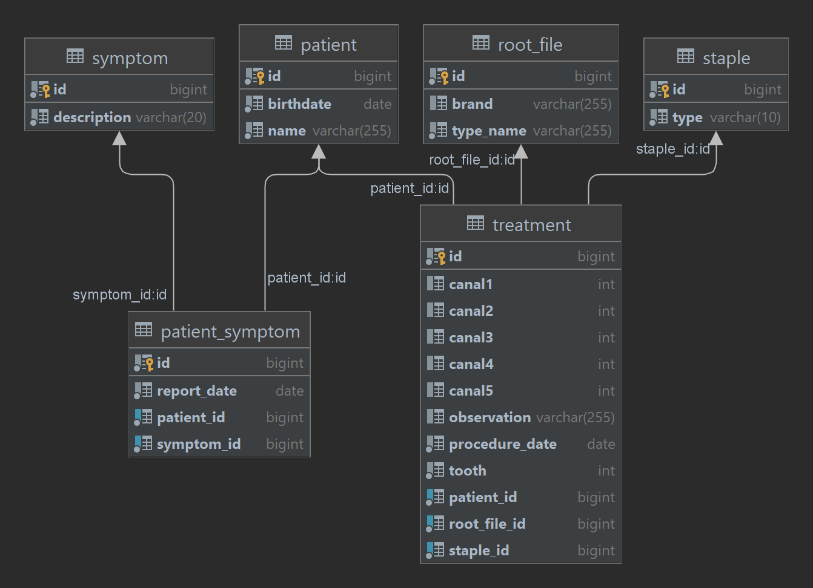

## First, the disclaimer

This project is one from a series that I'm doing as part of my studies on REST APIs. This is, in fact, the second
project, the first, and more experimental, one, lets call it the "Project 1", was done without the help of any Framework, just Java and JDBC (and a little bit 
of Gson), it is nowhere near this one in therms of features or whatever, but it can be seen [here](https://github.com/dimitriusborges/FrameworklessApi).

If you enter this repository right here and thinks "huuum, there are a lot of stuff missing.", you probably are right! I'm doing
it in my free time and when I'm feeling doing it, do it will be a slow evolution. But I do want to make things as right as possible, just don't be too judgmental, ok?

# Root Canal Api

## The proposed Project

The proposal of this project is the same as the Project 1, paraphrasing:

> The FrameworklessApi gives access to a small and very simple service dedicated to record, manipulate and expose data about my wife's Root Canal patients
> 
>  -- Meself

And, as stated on the Project 1, some data used here might have sensitive info, so I'm not sharing any of it. If there is data, it is fake.

### The Model

The service will have data representations of:

* Patients
* Root Canal instruments:
    * File
    * Staples
* Most common symptoms
* Treatment details
    * Tooth
    * instrument used
* Reported symptoms

Schema:

